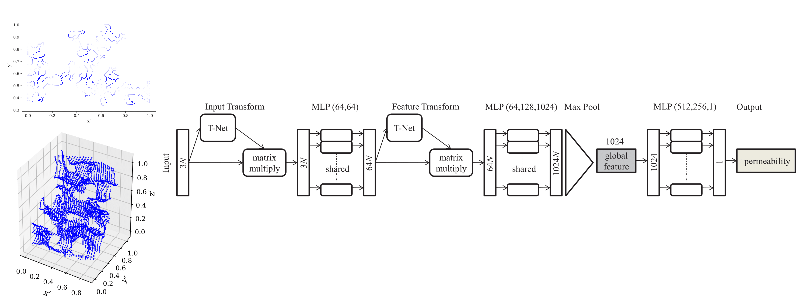
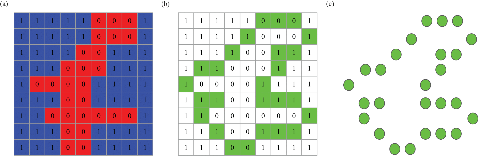

# Point-Cloud Deep Learning of Porous Media for Permeability Prediction

**Authors:** Ali Kashefi (kashefi@stanford.edu)  
**Description:** Implementation of PointNet for *supervised learning* of permeability of porous media using point clouds  
**Version:** 1.0  

**Citation**  
If you use the code, plesae cite the following journal paper:  
**[Point-cloud deep learning of porous media for permeability prediction](https://doi.org/10.1063/5.0063904)**

    @article{kashefi2021PointNetPorousMedia, 
      title={Point-cloud deep learning of porous media for permeability prediction},
      author={Kashefi, Ali and Mukerji, Tapan},
      journal={Physics of Fluids}, 
      volume={33}, 
      number={9}, 
      pages={097109},
      year={2021}, 
      publisher={AIP Publishing LLC}}

**Questions?**  
If you have any questions or need assistance, please do not hesitate to contact Ali Kashefi (kashefi@stanford.edu) via email. 
